# ESP485

## 简介

讨论群: `810581215`

[群友Carl的详细教程](https://songlin.me/2021/11/14/ddsu666-esp485/)

最近`Home Assistant`新增了<u>**`能源`**</u>模块，公司的项目又正好是数据采集相关的，看了下市面上卖的`Modbus`透传模块价格都不低，于是有了自己做的想法。请教硬件朋友，拿到了最简单的`485`转`TTL`电路。等了很久最近`ESPHome`终于初步支持了基于`RISC-V`架构的`ESP32-C3`（极低功耗、`CPU`温度、蓝牙`5.0`、`160 MHz`...非常强）。于是直接二者结合，搞出了指甲盖大小的`485`透传模块。把模块和变压器塞进了`正泰`导轨式模数化插座里（一举两得），测试电表用的是`正泰`的`DDSU666`（理论上支持所有`Modbus`设备数据透传）


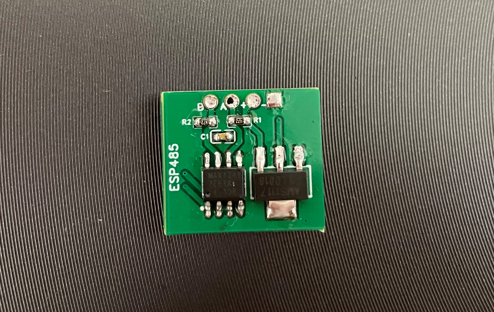

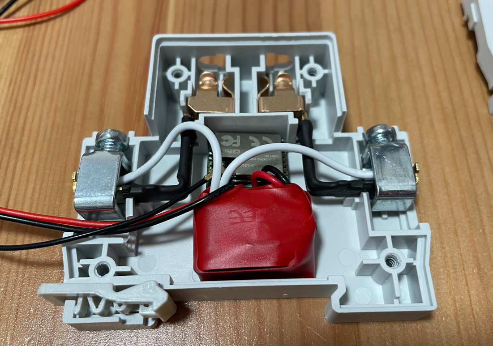

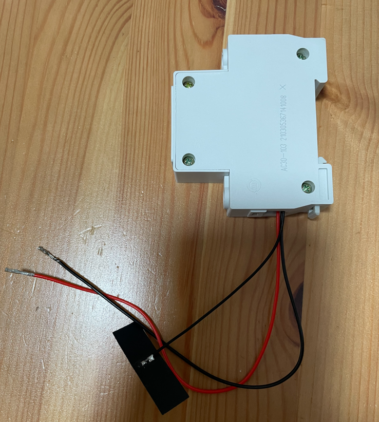

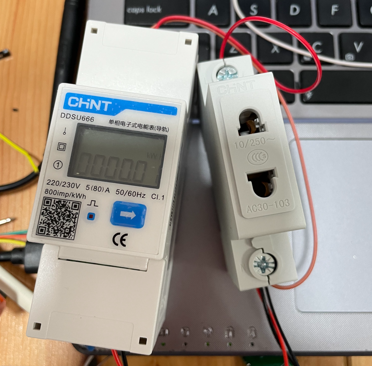

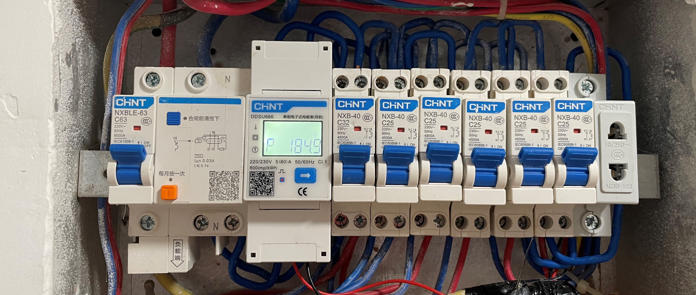


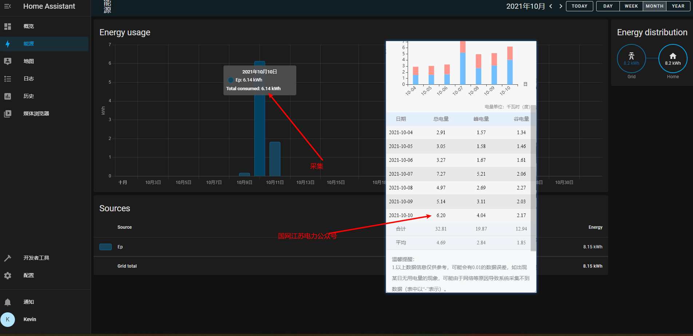

## `硬件`

### `材料清单`

清单只包含关键材料，不包含焊接工具、线材、刷机工具等辅助工具

| 名称 | 型号 | 数量 | PCB标注 | 链接 |
| ----- | ----- | ----: | :----: | :----: |
| ESP-C3-13U | 4M | 1 | ESP-C3-13U | [购买](https://item.taobao.com/item.htm?id=652413887471) |
| AMS1117-3.3 稳压电源芯片降压IC | AMS1117-3.3 | 1 | U1 | [购买](https://item.taobao.com/item.htm?id=522579028878) |
| MAX13487EESA SOIC-8 | - | 1 | U2 | [购买](https://item.taobao.com/item.htm?id=549097263944) |
| 0603贴片电阻 4.7KΩ | - | 1 | R1/R2 | [购买](https://item.taobao.com/item.htm?id=525820369368) |
| 0603贴片电容 50V 100NF ±10% | - | 1 | C1 | [购买](https://item.taobao.com/item.htm?id=537743724825) |
| 2.4G内置柔性FPC软天线  | IPEX接头 | 1 | - | [购买](https://item.taobao.com/item.htm?id=574057911861) |
| 220V转5V700mA电源模块 | 5V700mA | 1 | - | [购买](https://detail.tmall.com/item.htm?id=543443029399) |
| 正泰DDSU666  | 5-80A  ModBus | 1 | - | [购买](https://item.taobao.com/item.htm?id=38682717986) |
| 正泰模数化插座  | AC30-103 | 1 | - | [购买](https://item.taobao.com/item.htm?id=38332829590) |

### `焊接`

按`PCB`标注焊接即可，注意`ESP-C3-13U`的焊接，缝隙很小，一定要对齐

## `软件`

### `ESPHome`

这里[参考](https://github.com/martgras/esphome/wiki)

```yaml
substitutions:
  device_name: esp485

esphome:
  name: ${device_name}
  platformio_options:
    platform: https://github.com/tasmota/platform-espressif32.git#Tasmota/203
    platform_packages:
      - framework-arduinoespressif32@https://github.com/espressif/arduino-esp32.git#2.0.3
    board_build.flash_mode: dio
  on_boot:
    - priority: 600
      then:
        - esp32_ble_tracker.stop_scan:
    - priority: 200
      then:
        - esp32_ble_tracker.start_scan:

esp32:
  board: esp32-c3-devkitm-1
  framework:
    type: arduino

logger:

api:
  password: !secret api_password

ota:
  password: !secret ota_password

wifi:
  ssid: !secret wifi_ssid
  password: !secret wifi_password
  fast_connect: on

web_server:
  port: 80

button:
  - platform: restart
    name: ${device_name}_reboot
  
time:
  - platform: sntp
    id: ${device_name}_time
  
uart:
  id: ${device_name}_uart
  rx_pin: 18
  tx_pin: 19
  baud_rate: 9600
  data_bits: 8
  stop_bits: 1

modbus:
  id: ${device_name}_modbus
  send_wait_time: 200ms

modbus_controller:
  - id: ${device_name}_modbus_controller
    modbus_id: ${device_name}_modbus
    address: 0x01
    command_throttle: 200ms
    setup_priority: -10
    update_interval: 10s

sensor:
  - platform: modbus_controller
    modbus_controller_id: ${device_name}_modbus_controller
    id: ${device_name}_modbus_u
    name: U
    address: 0x2000
    register_count: 2
    unit_of_measurement: V
    register_type: holding
    value_type: FP32
    accuracy_decimals: 1
    device_class: voltage
    
  - platform: modbus_controller
    modbus_controller_id: ${device_name}_modbus_controller
    id: ${device_name}_modbus_i
    name: I
    address: 0x2002
    register_count: 2
    unit_of_measurement: A
    register_type: holding
    value_type: FP32
    accuracy_decimals: 3
    device_class: current
    
  - platform: modbus_controller
    modbus_controller_id: ${device_name}_modbus_controller
    id: ${device_name}_modbus_p
    name: P
    address: 0x2004
    register_count: 2
    unit_of_measurement: W
    register_type: holding
    value_type: FP32
    accuracy_decimals: 1
    filters:
      - multiply: 1000
    device_class: power
    
  - platform: modbus_controller
    modbus_controller_id: ${device_name}_modbus_controller
    id: ${device_name}_modbus_q
    name: Q
    address: 0x2006
    register_count: 2
    unit_of_measurement: var
    register_type: holding
    value_type: FP32
    accuracy_decimals: 1
    filters:
      - multiply: 1000
    device_class: power
    
  - platform: modbus_controller
    modbus_controller_id: ${device_name}_modbus_controller
    id: ${device_name}_modbus_s
    name: S
    address: 0x2008
    register_count: 2
    unit_of_measurement: VA
    register_type: holding
    value_type: FP32
    accuracy_decimals: 1
    filters:
      - multiply: 1000
    device_class: power
    
  - platform: modbus_controller
    modbus_controller_id: ${device_name}_modbus_controller
    id: ${device_name}_modbus_pf
    name: PF
    address: 0x200A
    register_count: 2
    register_type: holding
    value_type: FP32
    accuracy_decimals: 3
    device_class: power_factor
    
  - platform: modbus_controller
    modbus_controller_id: ${device_name}_modbus_controller
    id: ${device_name}_modbus_freq
    name: Freq
    address: 0x200E
    register_count: 2
    unit_of_measurement: Hz
    register_type: holding
    value_type: FP32
    accuracy_decimals: 2
    
  - platform: modbus_controller
    modbus_controller_id: ${device_name}_modbus_controller
    id: ${device_name}_modbus_ep
    name: Ep
    address: 0x4000
    register_count: 2
    unit_of_measurement: kWh
    register_type: holding
    value_type: FP32
    accuracy_decimals: 2
    device_class: energy
    state_class: total_increasing
    filters:
      - median:
          window_size: 3
          send_every: 3

# 重置Ep 群友提供未验证
switch:
  - platform: modbus_controller
    modbus_controller_id: ${device_name}_modbus_controller
    id: ${device_name}_modbus_ep_reset
    name: Ep_Reset
    custom_command: [0x01, 0x10, 0x00, 0x02, 0x00, 0x01, 0x02, 0x00, 0x01]
```

### `固件`

请参考 [ESPMMW](https://github.com/liwei19920307/ESPMMW/blob/main/README.md#%E6%95%99%E7%A8%8B) 

### `HASS`

打开`HA`管理界面（默认端口`8123`），点击配置，集成，添加集成，搜`ESPHome`，输入`IP`，`#api密码#`就可以接入模块了。能源里添加如下图
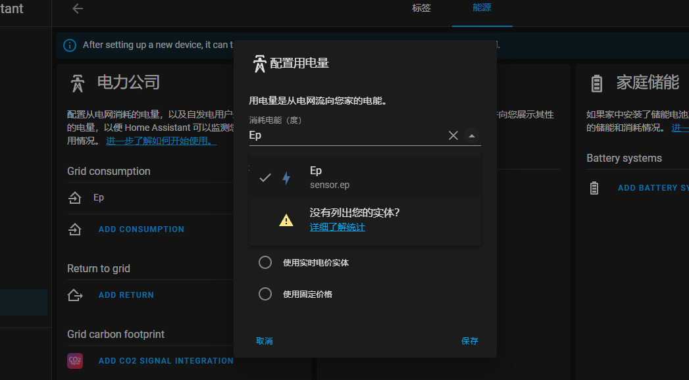

### `Modbus-RTU`

`Modbus`一般分`Modbus-TCP`和`Modbus-RTU`两个种，收发报文有所区别，这里不做过多介绍网上资料很多。我这里介绍`Modbus-RTU`的，`Modbus-TCP`由于没有设备无法测试。一般设备厂商设备说明书里都会提供地址说明（有的可以从官网下到），直接看图

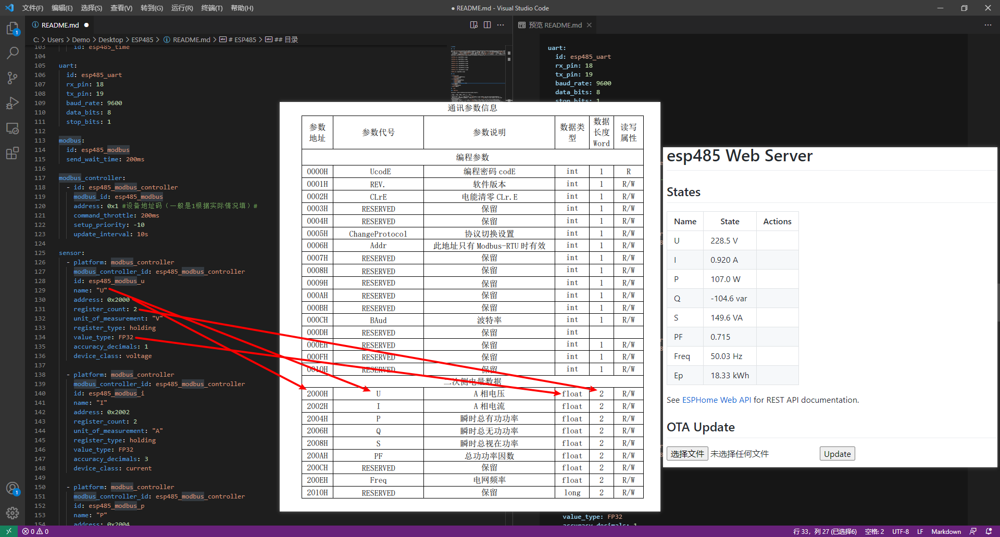

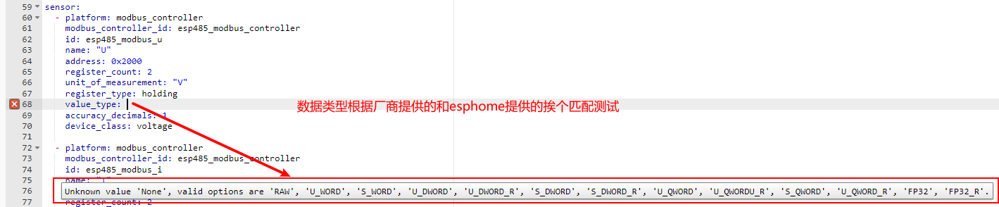

[DDSU666说明书](https://github.com/liwei19920307/ESP485/tree/main/doc/DDSU666.pdf)

## `DIY`

请参考之前`DIY`的[步骤](https://github.com/liwei19920307/S5in1#%E6%AD%A5%E9%AA%A4)

### `注意`

1、`EPS-C3-13U`进入下载模式只需要通电前将`IO9`接地，接法如下图

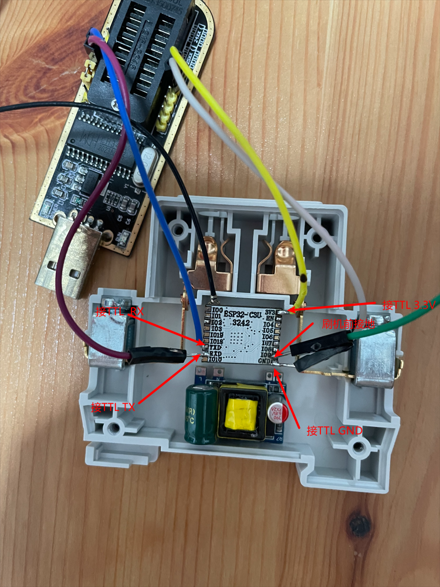

2、外壳和变压器安装注意做好绝缘

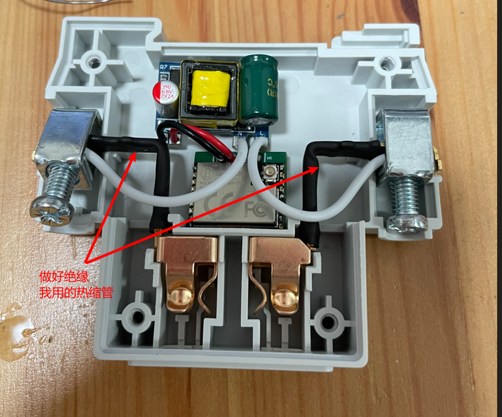

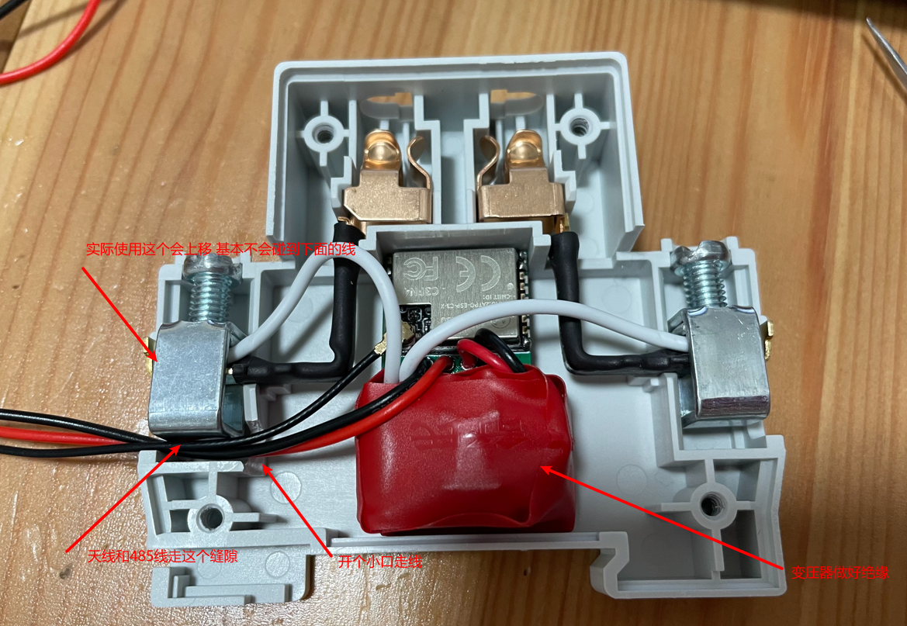
