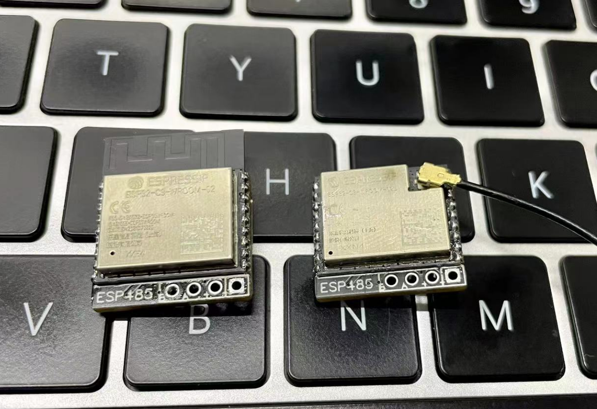
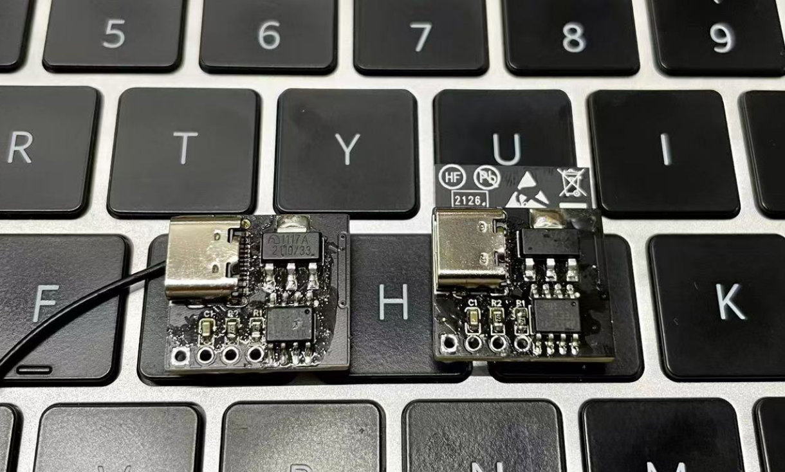
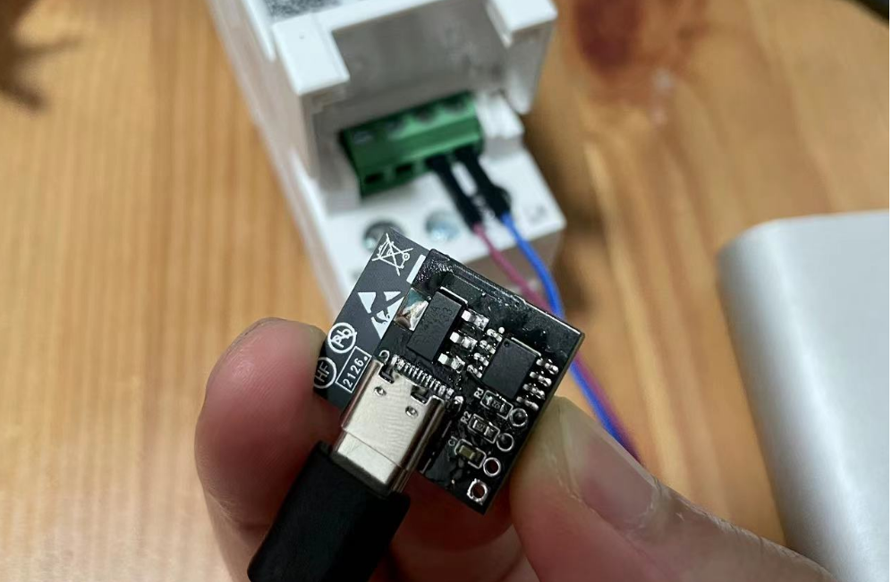
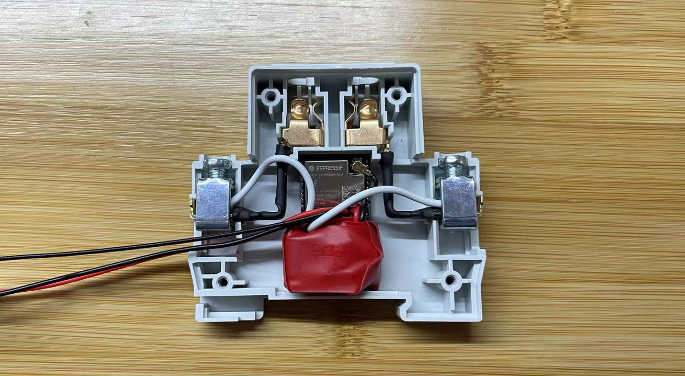
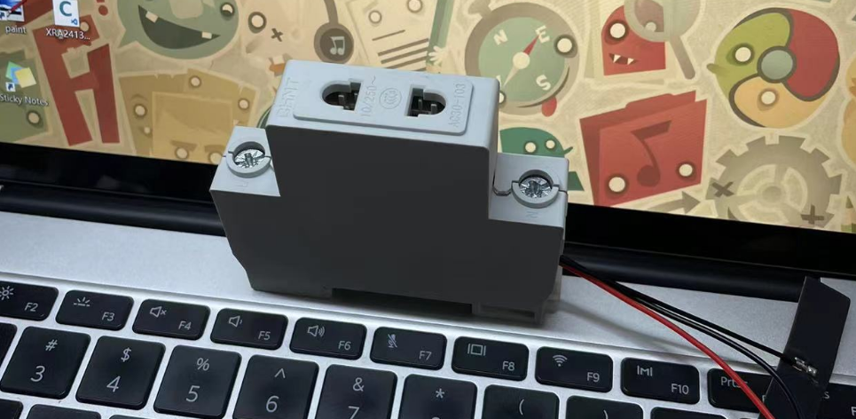

# ESP485

## 简介

讨论群: [810581215](https://qm.qq.com/cgi-bin/qm/qr?k=vNK4CIj_CZiKa_sp-mL8qP5cCqGs8-dZ&jump_from=webapi&authKey=Pu4vNUR+DD4cEF7r4nU0XO7SCHHpSVETB66ms4YGvbn27MWzkgaSrcHAN5/Dhuch)

在 1.0 基础上添加 TYPE-C 接口方便刷机，替换 C3 模块为乐鑫的（安信可和乐鑫关系崩了），PCB 兼容两个版本的 C3 模块，不带天线 ESP32-C3-WROOM-02U-N4（方便放入正泰模数化插座）和带天线 ESP32-C3-WROOM-02-H4 （适合不用壳 TYPE-C 供电裸奔的）












## 硬件

### 材料清单

# 一定要买 MODBUS 版本电表！！！

| 名称                         | 型号         | 数量 |       PCB 标注       |                           链接                            |
| ---------------------------- | ------------ | ---: | :------------------: | :-------------------------------------------------------: |
| ESP32-C3-WROOM-02U-N4        | -            |    1 | ESP32-C3-WROOM-02-H4 | [购买](https://item.taobao.com/item.htm?id=676812781013)  |
| ME1117A33B3G 稳压电源芯      | -            |    1 |        1117-3        | [购买](https://item.taobao.com/item.htm?id=645921052512)  |
| MAX13487EESA SOIC-8          | -            |    1 |         485          | [购买](https://item.taobao.com/item.htm?id=549097263944)  |
| 0603 贴片电阻 4.7KΩ          | -            |    1 |        R1/R2         | [购买](https://item.taobao.com/item.htm?id=525820369368)  |
| 0603 贴片电容 50V 100NF ±10% | -            |    1 |          C1          | [购买](https://item.taobao.com/item.htm?id=537743724825)  |
| 2.4G 内置柔性 FPC 软天线     | IPEX 接头    |    1 |          -           | [购买](https://item.taobao.com/item.htm?id=574057911861)  |
| Type-C 母座 16P              | -            |    1 |        TYPE-C        | [购买](https://item.taobao.com/item.htm?&id=573090887123) |
| 220V 转 5V700mA 电源模块     | 5V700mA      |    1 |          -           | [购买](https://detail.tmall.com/item.htm?id=543443029399) |
| 正泰 DDSU666                 | 5-80A ModBus |    1 |          -           |  [购买](https://item.taobao.com/item.htm?id=38682717986)  |
| 正泰模数化插座               | AC30-103     |    1 |          -           |  [购买](https://item.taobao.com/item.htm?id=38332829590)  |
| ESP32-C3-WROOM-02-H4         | -            |    1 | ESP32-C3-WROOM-02-H4 | [购买](https://item.taobao.com/item.htm?id=672590753429)  |

### 焊接

按 PCB 标注焊接即可，注意 C3 模块的焊接，缝隙很小，一定要对齐

## 软件

### ESPHome

- 直接采集

  [参考](https://github.com/martgras/esphome/wiki)

  ```yml
  substitutions:
    device_name: esp485

  esphome:
    name: ${device_name}

  esp32:
    board: esp32-c3-devkitm-1
    framework:
      type: arduino

  logger:

  api:
    encryption:
      key: !secret api_encryption_key

  ota:
    password: !secret ota_password

  wifi:
    ssid: !secret wifi_ssid
    password: !secret wifi_password
    fast_connect: on

  web_server:
    port: 80

  button:
    - platform: restart
      name: ${device_name}_reboot

  time:
    - platform: sntp
      id: ${device_name}_time

  uart:
    id: ${device_name}_uart
    rx_pin: 5
    tx_pin: 4
    baud_rate: 9600
    data_bits: 8
    stop_bits: 1

  modbus:
    id: ${device_name}_modbus
    send_wait_time: 200ms

  modbus_controller:
    - id: ${device_name}_modbus_controller
      modbus_id: ${device_name}_modbus
      address: 0x01
      command_throttle: 200ms
      setup_priority: -10
      update_interval: 10s

  text_sensor:
    - platform: wifi_info
      ip_address:
        name: ${device_name}_ip
      mac_address:
        name: ${device_name}_mac

  sensor:
    - platform: uptime
      name: ${device_name}_uptime
    - platform: wifi_signal
      name: ${device_name}_signal
      update_interval: 60s
    - platform: internal_temperature
      id: ${device_name}_cpu_temprature
      name: ${device_name}_cpu_temprature

    - platform: modbus_controller
      modbus_controller_id: ${device_name}_modbus_controller
      id: ${device_name}_u
      name: ${device_name}_u
      address: 0x2000
      register_count: 2
      unit_of_measurement: V
      register_type: holding
      value_type: FP32
      accuracy_decimals: 1
      device_class: voltage

    - platform: modbus_controller
      modbus_controller_id: ${device_name}_modbus_controller
      id: ${device_name}_i
      name: ${device_name}_i
      address: 0x2002
      register_count: 2
      unit_of_measurement: A
      register_type: holding
      value_type: FP32
      accuracy_decimals: 3
      device_class: current

    - platform: modbus_controller
      modbus_controller_id: ${device_name}_modbus_controller
      id: ${device_name}_p
      name: ${device_name}_p
      address: 0x2004
      register_count: 2
      unit_of_measurement: W
      register_type: holding
      value_type: FP32
      accuracy_decimals: 1
      filters:
        - multiply: 1000
      device_class: power

    - platform: modbus_controller
      modbus_controller_id: ${device_name}_modbus_controller
      id: ${device_name}_q
      name: ${device_name}_q
      address: 0x2006
      register_count: 2
      unit_of_measurement: var
      register_type: holding
      value_type: FP32
      accuracy_decimals: 1
      filters:
        - multiply: 1000
      device_class: power

    - platform: modbus_controller
      modbus_controller_id: ${device_name}_modbus_controller
      id: ${device_name}_s
      name: ${device_name}_s
      address: 0x2008
      register_count: 2
      unit_of_measurement: VA
      register_type: holding
      value_type: FP32
      accuracy_decimals: 1
      filters:
        - multiply: 1000
      device_class: power

    - platform: modbus_controller
      modbus_controller_id: ${device_name}_modbus_controller
      id: ${device_name}_pf
      name: ${device_name}_pf
      address: 0x200A
      register_count: 2
      register_type: holding
      value_type: FP32
      accuracy_decimals: 3
      device_class: power_factor

    - platform: modbus_controller
      modbus_controller_id: ${device_name}_modbus_controller
      id: ${device_name}_freq
      name: ${device_name}_freq
      address: 0x200E
      register_count: 2
      unit_of_measurement: Hz
      register_type: holding
      value_type: FP32
      accuracy_decimals: 2

    - platform: modbus_controller
      modbus_controller_id: ${device_name}_modbus_controller
      id: ${device_name}_ep
      name: ${device_name}_ep
      address: 0x4000
      register_count: 2
      unit_of_measurement: kWh
      register_type: holding
      value_type: FP32
      accuracy_decimals: 2
      device_class: energy
      state_class: total_increasing
      filters:
        - median:
            window_size: 3
            send_every: 3
  ```

- 透传模式

  通过 ESP 的 IP 和端口 666 透传数据，测试工具可以使用 SSCOM

  ```yml
  substitutions:
    device_name: esp485_stream

  esphome:
    name: ${device_name}

  external_components:
    - source: github://liwei19920307/esphome-stream-server
      components: [stream_server]

  stream_server:
    port: 666

  esp32:
    board: esp32-c3-devkitm-1
    framework:
      type: arduino

  logger:

  api:
    encryption:
      key: !secret api_encryption_key

  ota:
    password: !secret ota_password

  wifi:
    ssid: !secret wifi_ssid
    password: !secret wifi_password
    fast_connect: on

  web_server:
    port: 80

  button:
    - platform: restart
      name: ${device_name}_reboot

  time:
    - platform: sntp
      id: ${device_name}_time

  uart:
    id: ${device_name}_uart
    rx_pin: 5
    tx_pin: 4
    baud_rate: 9600
    data_bits: 8
    stop_bits: 1

  text_sensor:
    - platform: wifi_info
      ip_address:
        name: ${device_name}_ip
      mac_address:
        name: ${device_name}_mac

  sensor:
    - platform: uptime
      name: ${device_name}_uptime
    - platform: wifi_signal
      name: ${device_name}_signal
      update_interval: 60s
    - platform: internal_temperature
      id: ${device_name}_cpu_temprature
      name: ${device_name}_cpu_temprature
    - platform: stream_server
      connection_count:
        name: ${device_name}_connection_count

  binary_sensor:
    - platform: stream_server
      connected:
        name: ${device_name}_connected
  ```

## Modbus-RTU

Modbus 一般分 Modbus-TCP 和 Modbus-RTU 两个种，收发报文有所区别，这里不做过多介绍网上资料很多。我这里介绍 Modbus-RTU 的，Modbus-TCP 由于没有设备无法测试。一般设备厂商设备说明书里都会提供地址说明（有的可以从官网下到），直接看图


[DDSU666 说明书](https://github.com/liwei19920307/ESP485/tree/main/doc/DDSU666.pdf)

## 注意

外壳和变压器安装注意做好绝缘


## 其他设备

[DDSU666 三相](https://github.com/liwei19920307/ESP485/tree/main/2.0/other/DDSU666-3PHASE)

欢迎提交其他设备适配文件，麻烦按以上设备目录结构提交
